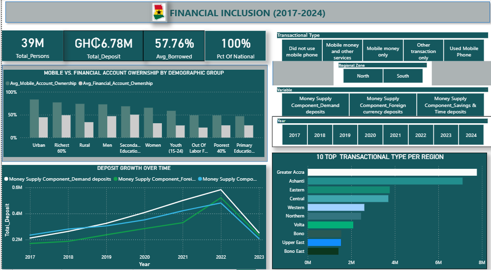
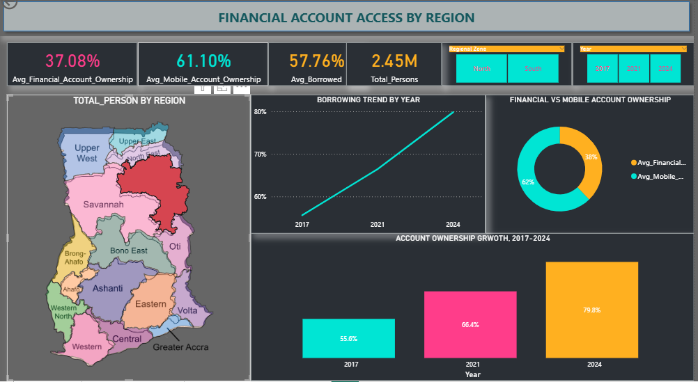

# Ghana_Financial_Inclusion(2017-2024)

# Project Overview

This project analyzes the evolution of financial inclusion in Ghana between 2017 and 2024. The analysis integrates mobile money usage data, money supply and deposit data, and regional demographic indicators to evaluate access, usage patterns, deposit stability, and borrowing growth.

# Project Objective

The analysis aimed to:

* Examine how financial inclusion evolved in Ghana from 2017 to 2024.
* Analyze deposit trends and mobile money usage patterns.
* Explore the relationship between interest rates, deposit behavior, and mobile money adoption.
* Identify financially underserved regions and explain structural gaps.
* Develop data driven recommendations to improve banking access and increase deposit mobilization.

# Data Source

* Global Findex Database (Mobile money) dataset:
Captured ownership and usage rates across regions.

* Monthly Monetary Survey(Money supply) dataset:
Tracked deposit levels, liquidity patterns, and circulation of funds.

* Regional and demographic dataset, (Interest dataset):
Linked inclusion indicators to specific regions and demographic groups.
Total population of 39M was derived by summing age brackets from this table to serve as the population base.

Methodology

* Population Base Definition
Established a consistent base representing of 39M individuals across the specified age categories using the demographic dataset.

* Transaction Segmentation
Classified individuals into digital transaction categories to measure depth of financial engagement.

* Deposit Structure Analysis
Measured composition of demand, savings and time, and foreign currency deposits to assess system stability.

* Trend Evaluation
Examined deposit trends from 2017 to 2023 and borrowing patterns from selected years between 2017 and 2024.

* Regional Assessment
Compared mobile money usage and inclusion indicators across regions to identify underserved areas and divided the region in to north and south

# Excel
* Fix messy multi row headers and renamed column headers.
* Fill in missing values in Education and transactional column using fowardfills.
* Standardized column names and remove special characters.
* Deleted all duplicate rows where the 2022 variables for November and December were recorded as 0.

# SQL (MySQL)
* Created relational database from multiple data sources.

# Python (Jupyter Notebook in VS Code)
* Connected directly to SQL database.
* Applied SUM(),AVG(),ROUND(),GROUP BY, and ORDER BY to aggregate age-group data, Calculate regional mobile money users, and rank regions by total.
* Used SQL CTEs to aggregate monthly deposit data into annual totals, joined deposit and Broad Money (M2) data by year and calculated their correlation  to identify the relationship between deposit behavior and money supply.

# Power BI

* Connected  directly to MySQL database for data access and analysis.
* Created a dimensional data model by separating fact and dimension tables.
* Established relationships between tables to support accurate filtering and aggregation.
* Built 7 DAX measures using functions such as CALCULATE, SUM, AVERAGE, and DISTINCTCOUNT to compute key metrics.
* Developed an interactive dashboard to analyze financial inclusion trends, deposit patterns, and regional disparities.
* Enabled filtering by region, year, gender, and income group for deeper analysis.

# Key Insights
1. Mobile money adoption shows meaningful digital financial participation where 30% of the national distribution, representing 12 million persons, use mobile money only for transaction. However, usage is concentrated in the southern regions, which account for 28% compared with 2% in the northern region highlighting a regional disparity in digital financial participation.

2. Mobile and non-mobile transaction usage remains nearly balanced at the national level, with 33% using mobile phones for transactions compared with 34% not using mobile phone for transactions.

3. Only 1% of the national distribution use other transaction methods while 2% use a combination of mobile money and other services, showing low adoption to alternative transaction type.

4. Across all demographic groups, mobile money account ownership stands at 61%, exceeding traditional financial account ownership at 37%, indicating stronger adoption of mobile-based financial services.

5. Mobile phone ownership is higher among urban residents at 83.3%, compared with 73.95% among rural residents. Financial account ownership follows a similar pattern, with urban residents at 44.6% compared with 33.82% in rural areas, highlighting an urban-rural gap in financial access.

6. Education level is associated with higher mobile phone ownership and financial account access. People with secondary or higher education recorded 68.58% mobile ownership and 50.23% financial account ownership, compared with 46.90% and 26.85%, respectively, among those with primary education.

 7. Total deposits across demand, savings and time deposits, and foreign currency deposits amounted to approximately GH₵6.78 million. Demand deposits accounted for the largest share at GH₵2.54 million, followed by savings and time deposits at GH₵2.28 million and foreign currency deposits at GH₵1.96 million. 
 
 8. Across demand deposits, savings and time deposits, total deposits peaked in 2022, foreign currency deposits peaked in 2021, and then dropped sharply in 2023.

 9. Average borrowing increased from 39.5% in 2017 to 73.52% in 2024, an 85.8% rise, based on data available for 2017, 2021, and 2024, with 2021 recording 51.58%

Data Limitation

* Financial inclusion data spans 2017 to 2024.
* Deposit data spans 2017 to 2023.
* Average borrowing data is available only for selected years, 2017, 2021, and 2024.

NB: Because deposit data is unavailable for 2024 and borrowing years are discontinuous, full year by year comparison between credit growth and deposit expansion is constrained.

# RECOMMENDATION

1. Increase digital financial education on mobile money, particularly in the Northern regions, to reduce the digital financial inclusion gap between Northern and Southern Ghana.

2. Banks should partner with telecommunications network providers to educate customers on how to use mobile banking and mobile money services safely effectively.

3. Given that mobile phone usage for transactions remains nearly split with non-mobile usage nationally, banks and network providers should invest in expanding mobile banking access and simplifying onboarding, to shift more of the population from non-mobile to mobile transaction methods.

4. Banks and telecommunications companies should develop savings products that encourage individuals to save regularly while providing opportunities to earn returns on their savings, reducing their reliance on borrowing.

5. Given the rise in average borrowing from 2017 to 2024, banks should monitor borrowing trends closely and pair loan products with financial planning resources to help customers manage debt responsibly

## Dashboard

This dashboard shows trends in financial inclusion, deposit growth, and regional disparities across Ghana.

## Project Structure

ghana-financial-inclusion-2017-2024/
│
├── data/ 
│   ├── raw/         # Original datasets from BoG, GSS, and World Bank in CSV and Excel format.
│   ├── cleaned/     # cleaned: Processed datasets with missing values handled and variables standardized.
│
├── mysql           # Database creation and structured storage of multiple datasets.
                    # SQL queries for data extraction, joins, and aggregation.
                    
├── notebooks/      # Jupyter notebooks in Python for data cleaning, querying  and performing trend analysis.
├── Power BI/       # Power BI files for data transformation, modeling, and dashboard development.
│   
└── README.md       # Project documentation including methodology, insights, and recommendations.

